# Gestión de Tareas del Hogar - API REST Segura

## Descripción del Proyecto
Esta es una API REST segura para la gestión de tareas del hogar. La aplicación permite a los usuarios registrarse, iniciar sesión, y gestionar sus tareas de manera eficiente. Además, incluye una funcionalidad de administración para gestionar las tareas de todos los usuarios.
---

## Tablas y Campos
El proyecto cuenta con las siguientes Tablas principales:

### 1. **Usuario**
Representa a un usuario registrado en la aplicación.

**Campos:**
- `id`: Identificador único del usuario.
- `nombre`: Nombre completo del usuario.
- `email`: Correo electrónico (único).
- `password`: Contraseña encriptada.
- `rol`: Rol del usuario (`USER` o `ADMIN`).
- `fecha_crea`: Fecha de creación del usuario.
- `direccion`: Direccion del Usuario

### 2. **Tarea**
Representa una tarea asignada a un usuario.

**Campos:**
- `id`: Identificador único de la tarea.
- `titulo`: Título de la tarea.
- `descripcion`: Descripción detallada de la tarea.
- `estado`: Estado de la tarea (`pendiente` o `hecha`).
- `usuario`: username(unico) del usuario al que se le asignó la tarea.
- `fecha_creacion`: Fecha de creación de la tarea.
- `fecha_actualizacion`: Fecha de la última actualización de la tarea.

---

## Endpoints y Descripción
### 1. **Autenticación y Registro**
- `POST /usuarios/register`: Registro de un nuevo usuario.
- `POST /usuarios/login`: Inicio de sesión y obtención del token JWT.

### 2. **Usuario con rol USER**
- `GET /tareas/self`: Ver sus propias tareas.
- `POST /tareas/self`: Crear una tarea para sí mismo.
- `PUT /tareas/self/{id}`: Marcar como hecha una tarea propia.
- `DELETE /tareas/self/{id}`: Eliminar una tarea propia.

### 3. **Usuario con rol ADMIN**
- `GET /tareas`: Ver todas las tareas de todos los usuarios.
- `POST /tareas`: Crear una tarea para cualquier usuario.
- `PUT /tareas/{id}`: Marcar como hecha cualquier tarea.
- `DELETE /tareas/{id}`: Eliminar cualquier tarea de cualquier usuario.

---

## Lógica de Negocio
1. **Registro y Login:**
    - Cualquier usuario puede registrarse y obtener un token JWT al iniciar sesión.
    - Se aplica validación de datos y encriptación de contraseñas.

2. **Gestión de Tareas:**
    - Los usuarios con rol `USER` pueden:
        - Ver, crear, marcar como hechas y eliminar solo sus propias tareas.
    - Los usuarios con rol `ADMIN` pueden:
        - Ver, crear, marcar como hechas y eliminar tareas de cualquier usuario.

---

## Excepciones y Códigos de Estado
- `400 Bad Request`: Datos de entrada inválidos o faltantes.
- `401 Unauthorized`: Intento de acceso sin autenticación.
- `403 Forbidden`: Intento de acceso a recursos no autorizados.
- `404 Not Found`: Recurso no encontrado (usuario o tarea inexistente).
- `409 Conflict`: El recurso ya existe no se puede volver a crear .
- `500 Internal Server Error`: Error interno en el servidor.

---

## Seguridad
- **JWT (JSON Web Tokens)** para autenticación y autorización.
- **Encriptación de contraseñas** con bcrypt.
- **Validación de roles y permisos**:
    - Solo los usuarios con rol `ADMIN` pueden gestionar tareas de otros usuarios.
    - Los usuarios con rol `USER` solo pueden gestionar sus propias tareas.
- **Validación de entradas** para prevenir inyecciones de código y otros ataques.
- **Control de acceso** para proteger los endpoints sensibles.

## PRUEBAS GESTIÓN USUARIOS

A continuación, se presentan las pruebas realizadas en **Insomnia** para comprobar el correcto funcionamiento del **registro** y **login** de usuarios.

### **1. Prueba de Registro de Usuario "USER"**

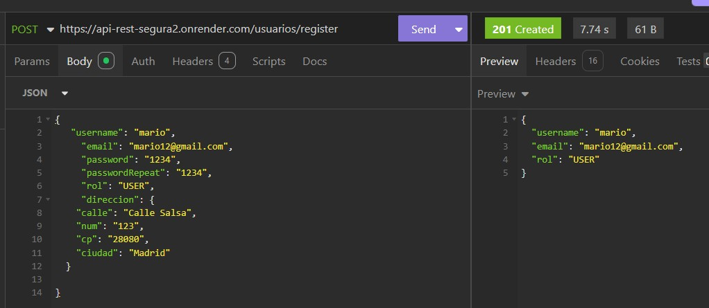
-
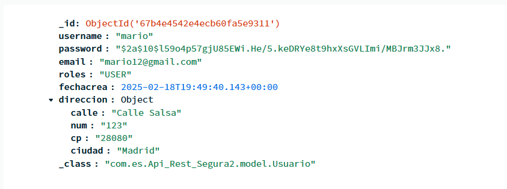

### **2. Prueba de Registro de Usuario "ADMIN"**
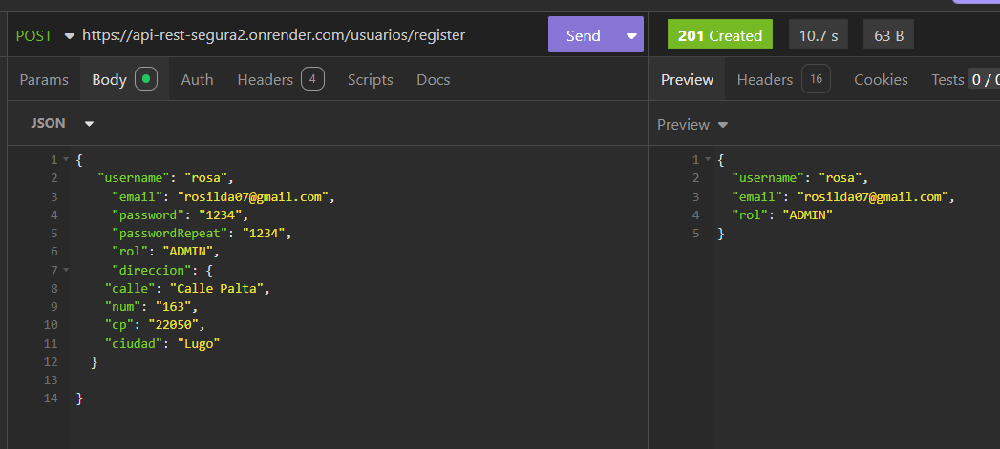
-
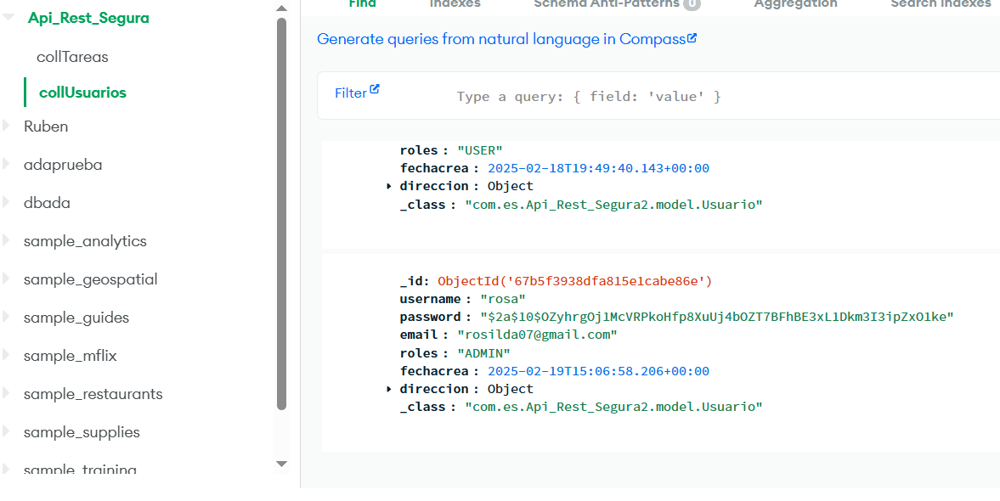

### **3. Prueba de Login de Usuario **
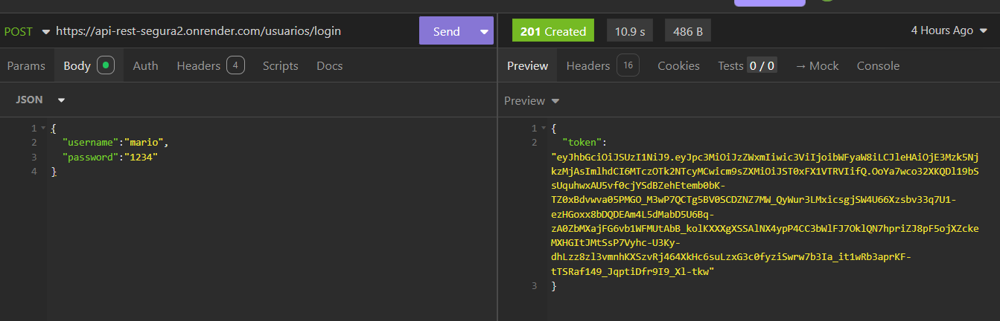

### **4. Prueba de Registro de Usuario "Errores**
#### Campo vacio
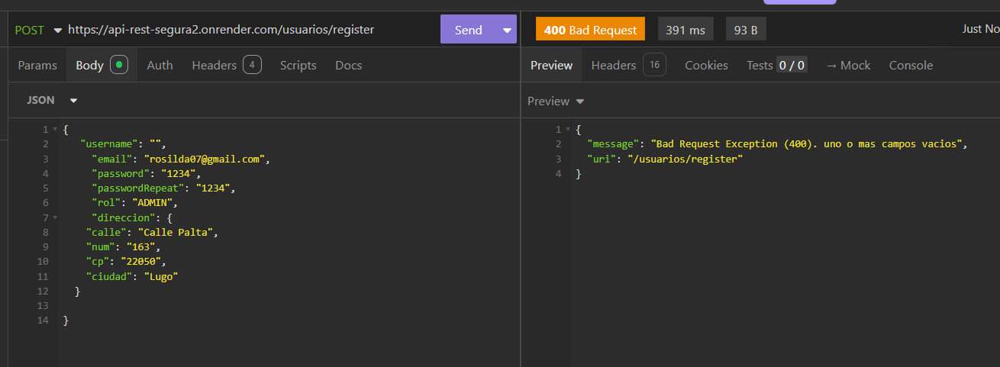
-
#### El email existe
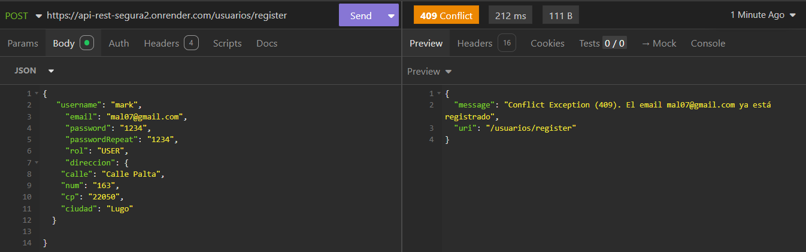
-
#### El usuario existe
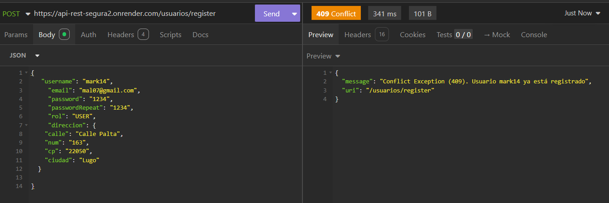
-
#### Contraseña no iguales

-
#### Rol incorrecto
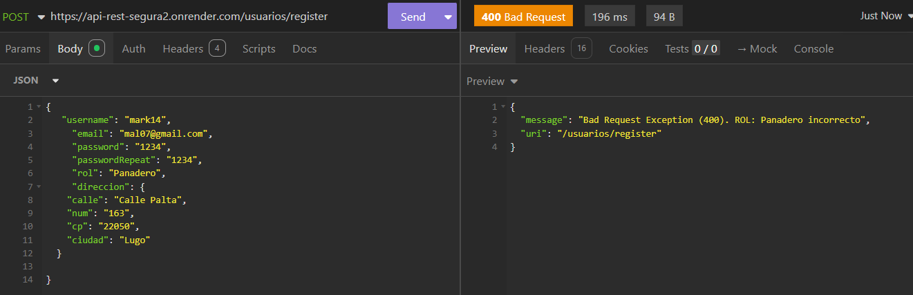
### **5. Prueba de Login de Usuario "Errores"**
#### Nombre o contraseña incorrecto
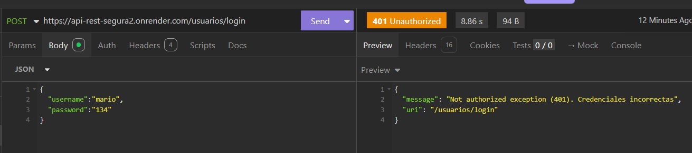

## PRUEBAS GESTIÓN USUARIOS INTERFAZ

A continuación, se presentan las pruebas realizadas en la **Interfaz** para comprobar el correcto funcionamiento del **registro** y **login** de usuarios.

Pd: el video se deberia descargar si haces click o en el sitio dandole "view Raw"

Operaciones que aparecen en el video de la interfaz 

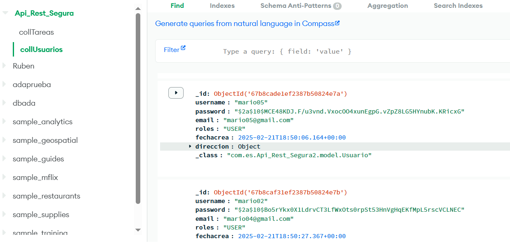

## PRUEBAS GESTIÓN TAREAS

A continuación, se presentan las pruebas realizadas en **Insomnia** para comprobar el correcto funcionamiento de las tareas

### **1. Prueba de Registro de "Tarea propia" "USER"**

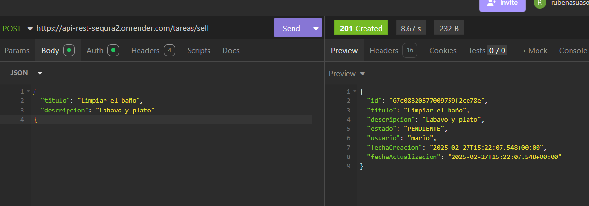
-
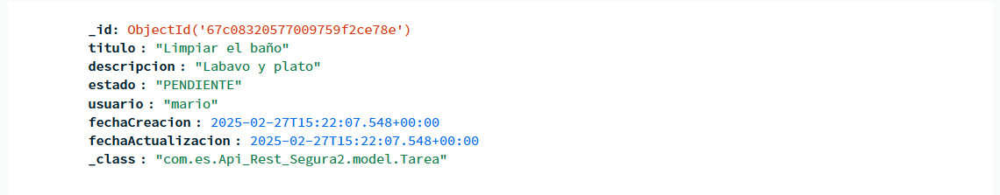
-

### **2. Prueba de Registro de "dar  Tarea" "ADMIN"**

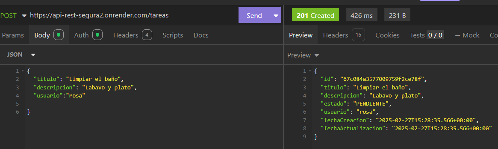

Sino eres admin 

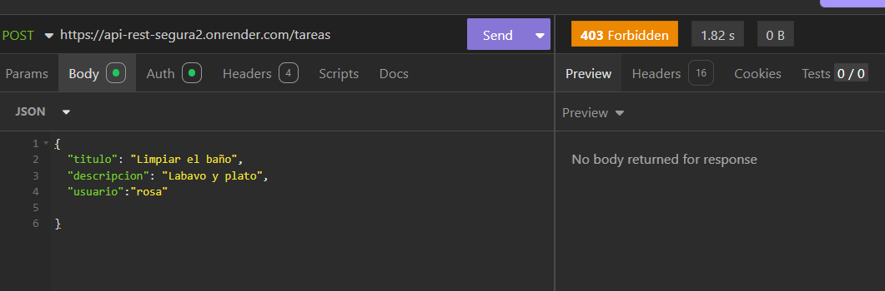

### **3. Prueba de ver tus tareas "USER"**

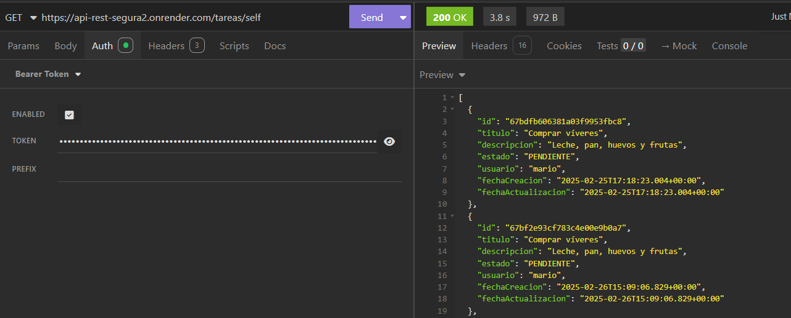

### **4. Prueba ver tareas  "ADMIN"**

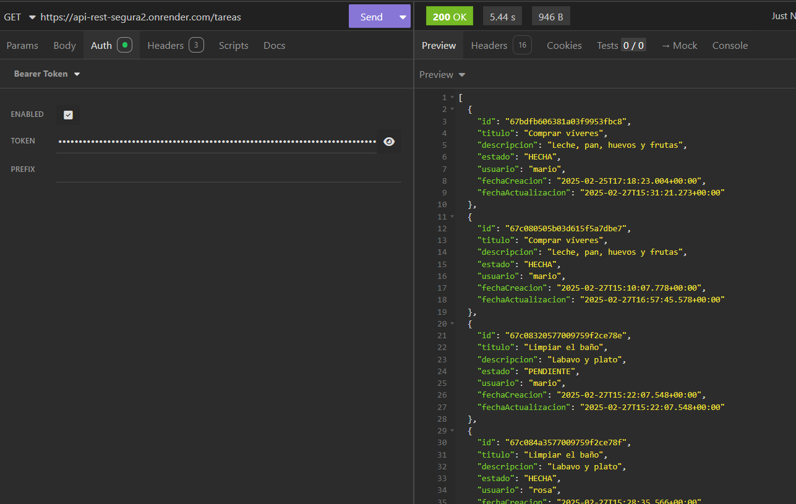

Sino eres admin 

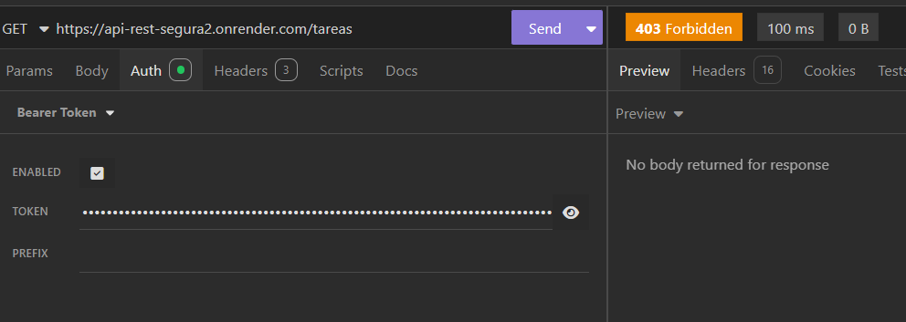

### **5. Prueba de actualizar tu estado "USER"**

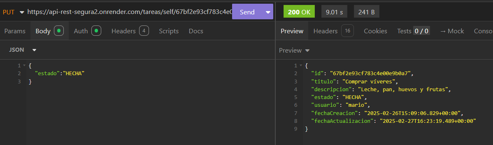

Sino te pertenece la tarea 

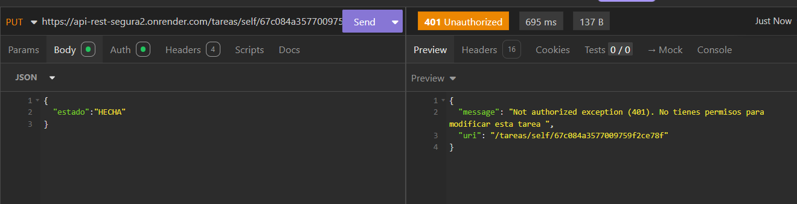

### **6. Prueba de actualizar estado  "ADMIN"**

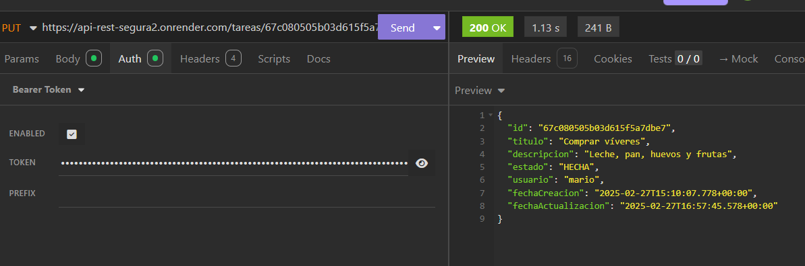

Sino eres admin 

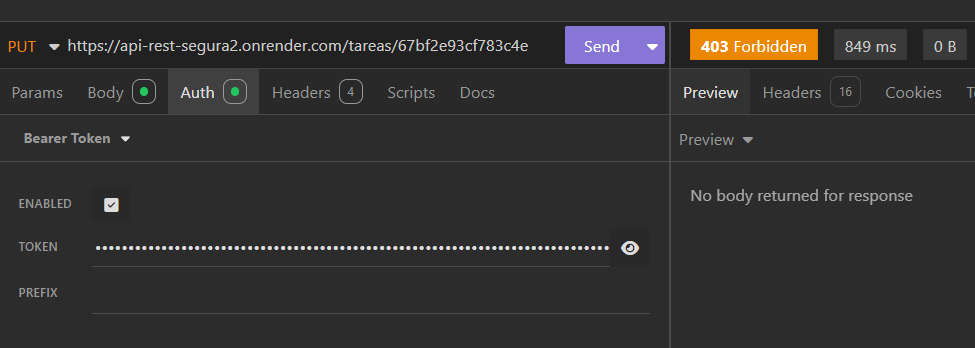

### **7. Prueba de eliminar tu tarea "USER"**

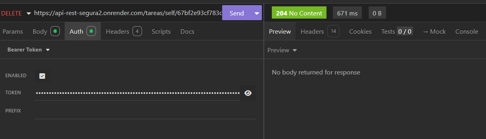
Sino te pertenece la tarea 

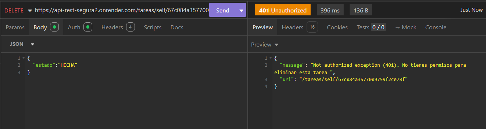

### **8. Prueba eliminar tareas  "ADMIN"**

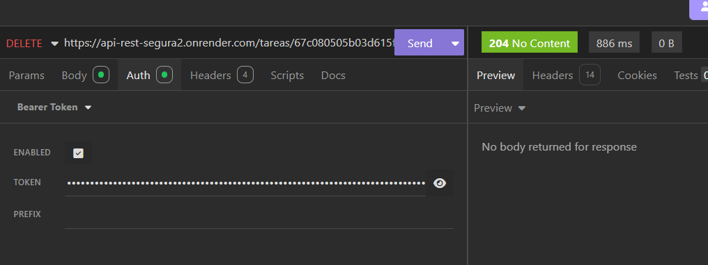

Sino eres admin 

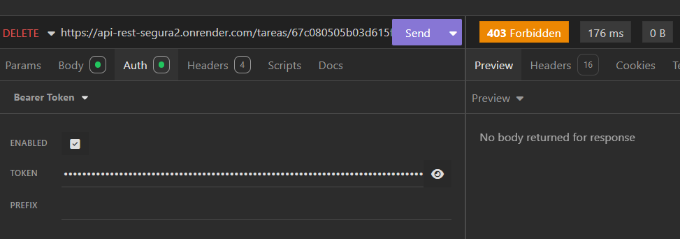

### **9. Prueba de Tareas "Errores"**
#### Campo vacio

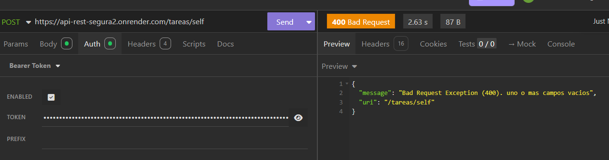
-
#### El usuario no existe
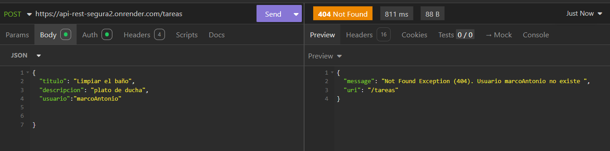
-
#### Estado incorrecto
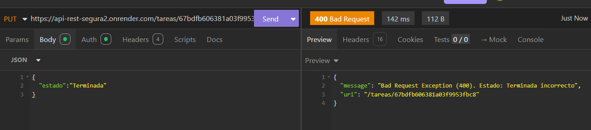

### Api Render
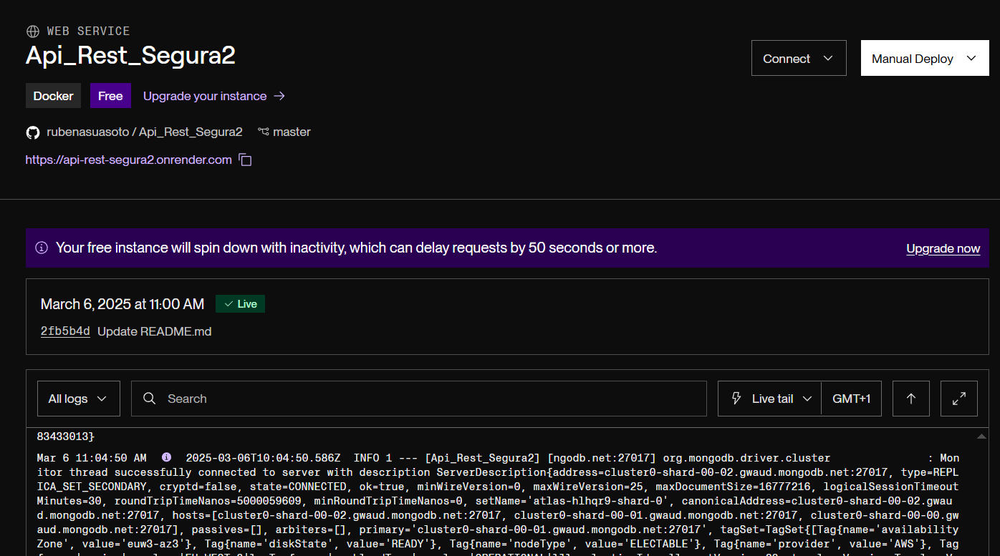

A continuación, se presentan las pruebas realizadas en la **Interfaz** para comprobar el correcto funcionamiento del **registro** y **login** de usuarios.

)

Pd: el video se deberia descargar si haces click o en el sitio dandole "view Raw"

